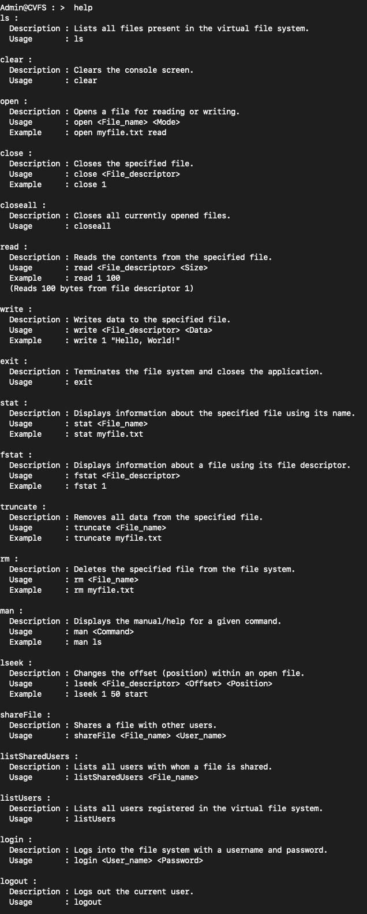
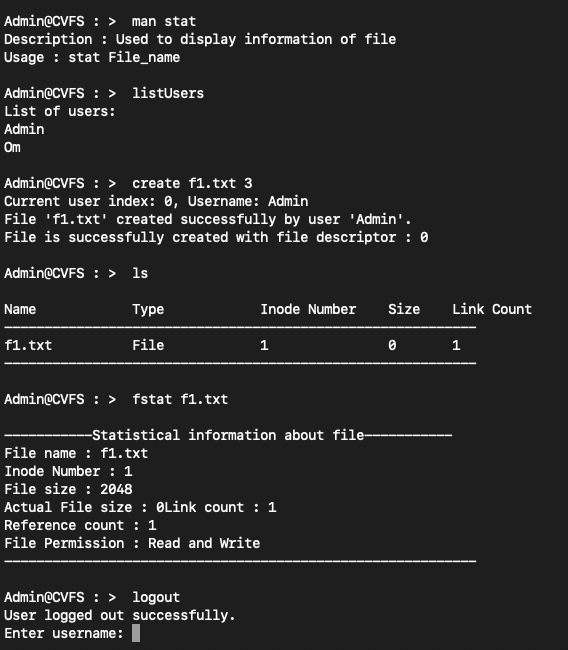

# InodeX File System

InodeX is a custom command-based multi-user virtual file system developed in C. It supports over 20 file commands, multi-user access with authentication, and file sharing with user-specific permissions.

## Features
- **Multi-User Access**: Manage user authentication and roles (Owner, Editor, Viewer).
- **File Commands**: 20+ commands for file operations (`ls`, `stat`, `lseek`, `open`, `read`, `write`, etc.).
- **File Sharing**: Share files with specific users and define their access rights.
- **Directory Structure**: Supports directories with hierarchical structures.

## User Roles
- **Owner**: Full control over the file.
- **Editor**: Can read and write to the file.
- **Viewer**: Can only read the file.

## Getting Started

### Prerequisites
- C Compiler (e.g., GCC)
- Standard C Library

## Usage

### File Commands

- `create <File_name> <Permission>`: Used to create a new regular file.
  - **Usage**: `create File_name Permission`
  - **Description**: Creates a file with specified permissions.

- `read <File_name> <No_of_bytes_to_read>`: Used to read from a regular file.
  - **Usage**: `read File_name No_of_bytes_to_read`
  - **Description**: Reads specified number of bytes from a file.

- `write <File_name>`: Used to write into the regular file.
  - **Usage**: `write File_name`, Click Enter, then enter the data that you want to write.
  - **Description**: Writes data to the specified file.

- `ls`: Used to list all information of files.
  - **Usage**: `ls`
  - **Description**: Lists all files present in the virtual file system.

- `stat <File_name>`: Used to display information of a file.
  - **Usage**: `stat File_name`
  - **Description**: Displays information about the specified file using its name.

- `fstat <File_descriptor>`: Used to display information of a file.
  - **Usage**: `fstat File_descriptor`
  - **Description**: Displays information about a file using its file descriptor.

- `truncate <File_name>`: Used to remove data from the regular file.
  - **Usage**: `truncate File_name`
  - **Description**: Removes all data from the specified file.

- `open <File_name> <Mode>`: Used to open an existing file.
  - **Usage**: `open File_name Mode`
  - **Description**: Opens a file for reading or writing.

- `close <File_name>`: Used to close an opened file.
  - **Usage**: `close File_name`
  - **Description**: Closes the specified file.

- `closeall`: Used to close all opened files.
  - **Usage**: `closeall`
  - **Description**: Closes all currently opened files.

- `lseek <File_name> <ChangeInOffset> <StartPoint>`: Used to change file offset.
  - **Usage**: `lseek File_name ChangeInOffset StartPoint`
  - **Description**: Changes the offset (position) within an open file.

- `rm <File_name>`: Used to delete a file.
  - **Usage**: `rm File_name`
  - **Description**: Deletes the specified file from the file system.

### Directory Commands

- `mkdir <Dir_name>`: Used to create a new directory.
  - **Usage**: `mkdir <Dir_name>`
  - **Description**: Creates a new directory.

- `rmdir <Dir_name>`: Used to remove an existing directory.
  - **Usage**: `rmdir <Dir_name>`
  - **Description**: Removes an existing directory.

- `cd <Dir_name>`: Used to change the current directory.
  - **Usage**: `cd <Dir_name>`
  - **Description**: Changes the current directory.

- `pwd`: Used to display the current directory path.
  - **Usage**: `pwd`
  - **Description**: Displays the current directory path.

### User Commands

- `shareFile <File_name> <User_name>`: Used to share a file with other users.
  - **Usage**: `shareFile <File_name> <User_name>`
  - **Description**: Shares a file with specified user.

- `listSharedUsers <File_name>`: Used to list all users with whom a file is shared.
  - **Usage**: `listSharedUsers <File_name>`
  - **Description**: Lists all users with whom a file is shared.

- `listUsers`: Used to list all users registered in the virtual file system.
  - **Usage**: `listUsers`
  - **Description**: Lists all users registered in the virtual file system.

- `login <User_name> <Password>`: Used to log into the file system with a username and password.
  - **Usage**: `login <User_name> <Password>`
  - **Description**: Logs into the file system with the specified username and password.

- `logout`: Used to log out the current user.
  - **Usage**: `logout`
  - **Description**: Logs out the current user.

### Utility Commands

- `clear`: Used to clear the console screen.
  - **Usage**: `clear`
  - **Description**: Clears the console screen.

- `exit`: Used to terminate the file system and close the application.
  - **Usage**: `exit`
  - **Description**: Terminates the file system and closes the application.

- `man <Command>`: Used to display the manual/help for a given command.
  - **Usage**: `man <Command>`
  - **Description**: Displays the manual for the specified command.

### Examples

- `create myfile.txt 1`: Create a new regular file with read/write permissions.
- `read myfile.txt 100`: Read 100 bytes from the file `myfile.txt`.
- `write myfile.txt`: Write data to the file `myfile.txt` (data entered after the command).
- `ls`: List all files in the current directory.
- `stat myfile.txt`: Display information about the file `myfile.txt`.
- `fstat 1`: Display information about the file using file descriptor 1.
- `truncate myfile.txt`: Remove data from the file `myfile.txt`.
- `open myfile.txt read`: Open the file `myfile.txt` in read mode.
- `close myfile.txt`: Close the file `myfile.txt`.
- `closeall`: Close all opened files.
- `lseek myfile.txt 50 start`: Change the file offset of `myfile.txt` to 50 from the start.
- `rm myfile.txt`: Delete the file `myfile.txt`.
- `mkdir mydir`: Create a new directory named `mydir`.
- `rmdir mydir`: Remove the directory named `mydir`.
- `cd mydir`: Change to the directory `mydir`.
- `pwd`: Display the current directory path.
- `shareFile myfile.txt john`: Share the file `myfile.txt` with user `john`.
- `listSharedUsers myfile.txt`: List all users with whom `myfile.txt` is shared.
- `listUsers`: List all users in the file system.
- `login john password123`: Log into the file system as user `john`.
- `logout`: Log out the current user.
- `clear`: Clear the console screen.
- `exit`: Terminate the file system and close the application.
- `man ls`: Display the manual for the `ls` command.

## Screenshots

